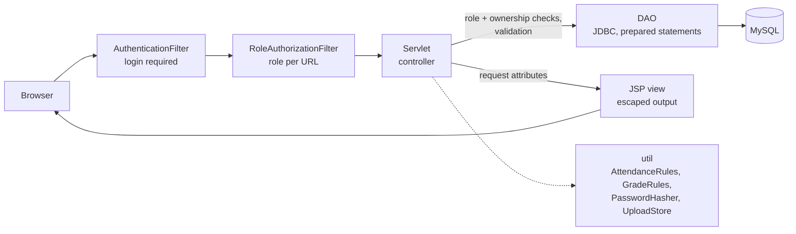

<p align="center">
  
</p>

<h1 align="center">CampusCore</h1>

<p align="center">
  <strong>A smart campus management system for students, teachers and administrators.</strong>
</p>

<p align="center">
  
  
  
  
  
  
</p>

CampusCore is a full-stack web application that runs the academic and administrative side of a campus in one portal: semesters and classes, courses and enrollment, lecture-by-lecture attendance, marks and grading, GPA/CGPA and transcripts, add/drop requests, fee challans with payment proofs, announcements, messaging and a help desk.

It is built with **Java 17, Jakarta Servlets/JSP and MySQL** in a classic MVC structure, with no web framework: request handling, data access, access control, validation and security are written directly on the Servlet API and JDBC.

<p align="center">
  <a href="https://campuscore-web-9ehv.onrender.com"></a>
</p>

---

## Live demo

**[campuscore-web-9ehv.onrender.com](https://campuscore-web-9ehv.onrender.com)**: log in with any of these accounts (the login page also has one-click buttons):

| Role | Username | Password |
|---|---|---|
| Administrator | `ADMIN` | `ADMIN123` |
| Teacher | `TEACHER1` | `Teacher123` |
| Student | `BCSF22M512` | `Usman123` |

- All data is **fictional** and is **reset every night**, so feel free to try everything: mark attendance, enter and publish grades, issue challans, approve requests, post announcements.
- The demo accounts themselves cannot be edited, deactivated or given a new password, so they always work for the next visitor.
- Free hosting: if the demo has been idle, **the first page can take up to a minute** to wake up; after that pages load in well under a second. Times are shown in UTC.

---

## Contents

- [Live demo](#live-demo)
- [Highlights](#highlights)
- [Screenshots](#screenshots)
- [Features](#features)
- [Academic rules](#academic-rules)
- [Architecture](#architecture)
- [Security](#security)
- [Getting started](#getting-started)
- [Deployment](#deployment)
- [Testing](#testing)
- [Project structure](#project-structure)
- [Roadmap](#roadmap)
- [Author](#author)

---

## Highlights

- **Three role-based portals** (student, teacher, admin), each with a dashboard that shows what needs attention: overdue fees, low attendance, unmarked lectures, grades about to lock, or set-up gaps such as a course without a teacher.
- **Per-class semesters**: terms such as *Fall 2024* are shared, while every class has its own semester number in them, so each student sees e.g. *Fall 2024-3rd Semester*.
- **Lecture-based attendance** with an edit window, duplicate-safe saving and live percentages.
- **Grading that handles real cases**: marks not yet entered, partial results, publishing, a post-term edit window, withdrawals (W), repeated courses and a printable transcript with GPA/CGPA.
- **Security built in**: PBKDF2 password hashing, server-side role and ownership checks on every action, prepared statements, output escaping, and validated, private file uploads.
- **Migrations for existing databases**, a fresh-install schema with sample data, and JUnit tests for the business rules.

## Screenshots

> Screenshots use fictional demo data. Click any image to open it at full size.

### Admin portal

<a href="docs/screenshots/admin/02-dashboard.png"></a>

**Dashboard**: totals, work that needs attention (classes without a semester, courses without a teacher, payment proofs, add/drop requests, tickets, overdue fees), each class's current semester, fee collection and the latest announcements.

<details>
<summary><b>Sign-in and account</b></summary>
<br>
<table>
<tr><td width="50%" valign="top"><a href="docs/screenshots/admin/01-login.png"></a><br><b>Login</b><br><sub>Role-based sign-in for students, teachers and administrators.</sub></td><td width="50%" valign="top"><a href="docs/screenshots/admin/23-update-profile.png"></a><br><b>Update profile</b><br><sub>Personal and contact details.</sub></td></tr>
<tr><td width="50%" valign="top"><a href="docs/screenshots/admin/24-change-password.png"></a><br><b>Change password</b><br><sub>Passwords are stored as PBKDF2 hashes.</sub></td><td width="50%"></td></tr>
</table>
</details>

<details>
<summary><b>Students and teachers</b></summary>
<br>
<table>
<tr><td width="50%" valign="top"><a href="docs/screenshots/admin/03-manage-teachers.png"></a><br><b>Manage teachers</b><br><sub>Add, search and filter by department; activate, deactivate or delete.</sub></td><td width="50%" valign="top"><a href="docs/screenshots/admin/04-edit-teacher.png"></a><br><b>Edit a teacher</b><br><sub>The form opens with the teacher's details filled in.</sub></td></tr>
<tr><td width="50%" valign="top"><a href="docs/screenshots/admin/05-manage-students.png"></a><br><b>Manage students</b><br><sub>Every student with class, status and search by name, roll number or class.</sub></td><td width="50%" valign="top"><a href="docs/screenshots/admin/06-edit-student.png"></a><br><b>Edit a student</b><br><sub>Change details, class or status; roll number stays unique.</sub></td></tr>
</table>
</details>

<details>
<summary><b>Classes, courses and enrollment</b></summary>
<br>
<table>
<tr><td width="50%" valign="top"><a href="docs/screenshots/admin/07-classes-departments.png"></a><br><b>Classes and departments</b><br><sub>e.g. BS Computer Science-2026 in the Computer Science department.</sub></td><td width="50%" valign="top"><a href="docs/screenshots/admin/08-manage-courses.png"></a><br><b>Manage courses</b><br><sub>Department, credit hours and the classes each course is offered to.</sub></td></tr>
<tr><td width="50%" valign="top"><a href="docs/screenshots/admin/09-edit-course.png"></a><br><b>Edit a course</b><br><sub>Change a course and the classes it is offered to.</sub></td><td width="50%" valign="top"><a href="docs/screenshots/admin/10-faculty-assignment.png"></a><br><b>Faculty assignment</b><br><sub>Assign a teacher to a course for a term; the course's own department is listed first.</sub></td></tr>
<tr><td width="50%" valign="top"><a href="docs/screenshots/admin/11-enrollment.png"></a><br><b>Enrollment</b><br><sub>Enroll one, several or all students of the course's classes; drop when needed.</sub></td><td width="50%"></td></tr>
</table>
</details>

<details>
<summary><b>Semesters</b></summary>
<br>
<table>
<tr><td width="50%" valign="top"><a href="docs/screenshots/admin/12-manage-semesters.png"></a><br><b>Manage semesters</b><br><sub>Shared terms, per-class semester numbers, bulk placement and filters.</sub></td><td width="50%" valign="top"><a href="docs/screenshots/admin/13-edit-semester.png"></a><br><b>Edit a term</b><br><sub>Rename a term or change its dates.</sub></td></tr>
</table>
</details>

<details>
<summary><b>Add / drop requests</b></summary>
<br>
<table>
<tr><td width="50%" valign="top"><a href="docs/screenshots/admin/14-add-drop-requests.png"></a><br><b>Add / drop requests</b><br><sub>Approve or reject; the enrollment is updated in the same step.</sub></td><td width="50%"></td></tr>
</table>
</details>

<details>
<summary><b>Fee challans</b></summary>
<br>
<table>
<tr><td width="50%" valign="top"><a href="docs/screenshots/admin/15-fee-challans.png"></a><br><b>Fee challans</b><br><sub>Issue to many students at once, review payment proofs, mark paid or unpaid.</sub></td><td width="50%" valign="top"><a href="docs/screenshots/admin/16-challan-voucher.png"></a><br><b>Printable voucher</b><br><sub>Bank, accounts and student copies, with PAID / OVERDUE stamps.</sub></td></tr>
</table>
</details>

<details>
<summary><b>Announcements, messages and help desk</b></summary>
<br>
<table>
<tr><td width="50%" valign="top"><a href="docs/screenshots/admin/17-announcements.png"></a><br><b>Announcements</b><br><sub>General announcements for everyone, students only or teachers only.</sub></td><td width="50%" valign="top"><a href="docs/screenshots/admin/18-edit-announcement.png"></a><br><b>Edit an announcement</b><br><sub>Edit text and audience; edits are timestamped.</sub></td></tr>
<tr><td width="50%" valign="top"><a href="docs/screenshots/admin/19-messages.png"></a><br><b>Messages</b><br><sub>Recipient search with role, class, department and course filters, and multi-select.</sub></td><td width="50%" valign="top"><a href="docs/screenshots/admin/20-messages-sent.png"></a><br><b>Sent messages</b><br><sub>Broadcasts are shown once, with all their recipients.</sub></td></tr>
<tr><td width="50%" valign="top"><a href="docs/screenshots/admin/21-help-desk.png"></a><br><b>Help desk</b><br><sub>Open and answered tickets, teachers first (with department), then students (with class).</sub></td><td width="50%" valign="top"><a href="docs/screenshots/admin/22-help-desk-reply.png"></a><br><b>Reply to a ticket</b><br><sub>Pick an open ticket and reply; the ticket is closed.</sub></td></tr>
</table>
</details>

### Teacher portal

<a href="docs/screenshots/teacher/01-dashboard.png"></a>

**Dashboard**: current courses, students and unread messages, what needs attention (no attendance in the last 7 days, results unpublished before grades lock), this term at a glance and the latest announcements.

<details>
<summary><b>Course list</b></summary>
<br>
<table>
<tr><td width="50%" valign="top"><a href="docs/screenshots/teacher/02-course-list.png"></a><br><b>Course list</b><br><sub>Every assigned course with students, lectures, grading progress and announcements, and a button for each task.</sub></td><td width="50%"></td></tr>
</table>
</details>

<details>
<summary><b>Attendance</b></summary>
<br>
<table>
<tr><td width="50%" valign="top"><a href="docs/screenshots/teacher/03-mark-attendance-courses.png"></a><br><b>Mark attendance: courses</b><br><sub>Courses open for attendance, and past courses (view only).</sub></td><td width="50%" valign="top"><a href="docs/screenshots/teacher/04-attendance-new-lecture.png"></a><br><b>New lecture</b><br><sub>Everyone starts as Present; bulk all present / absent / leave, optional topic and a live tally. Below 75% is shown in red.</sub></td></tr>
<tr><td width="50%" valign="top"><a href="docs/screenshots/teacher/05-attendance-edit-lecture.png"></a><br><b>Edit a lecture</b><br><sub>A marked date opens for editing within 7 days, showing who marked and who last changed it.</sub></td><td width="50%" valign="top"><a href="docs/screenshots/teacher/06-attendance-past-course.png"></a><br><b>Past course (view only)</b><br><sub>Lectures of an earlier term stay visible but locked.</sub></td></tr>
</table>
</details>

<details>
<summary><b>Grades</b></summary>
<br>
<table>
<tr><td width="50%" valign="top"><a href="docs/screenshots/teacher/07-upload-grades-courses.png"></a><br><b>Upload grades: courses</b><br><sub>Courses open for grading (until 10 days after the term ends) and locked ones.</sub></td><td width="50%" valign="top"><a href="docs/screenshots/teacher/08-grade-sheet.png"></a><br><b>Grade sheet</b><br><sub>Live total and grade, blank for marks not entered yet, invalid marks highlighted, publish per student or all at once.</sub></td></tr>
<tr><td width="50%" valign="top"><a href="docs/screenshots/teacher/09-grade-sheet-locked.png"></a><br><b>Locked grade sheet</b><br><sub>More than 10 days after the term ended: view only.</sub></td><td width="50%"></td></tr>
</table>
</details>

<details>
<summary><b>Announcements</b></summary>
<br>
<table>
<tr><td width="50%" valign="top"><a href="docs/screenshots/teacher/10-course-announcements.png"></a><br><b>Course announcements</b><br><sub>Post to the students enrolled in one course offering.</sub></td><td width="50%" valign="top"><a href="docs/screenshots/teacher/11-edit-course-announcement.png"></a><br><b>Edit an announcement</b><br><sub>Edit or delete; edits are timestamped.</sub></td></tr>
<tr><td width="50%" valign="top"><a href="docs/screenshots/teacher/12-announcements.png"></a><br><b>General announcements</b><br><sub>Announcements from the administration for teachers.</sub></td><td width="50%"></td></tr>
</table>
</details>

<details>
<summary><b>Messages, help desk and FAQs</b></summary>
<br>
<table>
<tr><td width="50%" valign="top"><a href="docs/screenshots/teacher/13-message-course-students.png"></a><br><b>Message course students</b><br><sub>Opens with exactly that course's students selected and the picker filtered to the course.</sub></td><td width="50%" valign="top"><a href="docs/screenshots/teacher/14-messages-sent.png"></a><br><b>Sent messages</b><br><sub>Messages sent, with their recipients.</sub></td></tr>
<tr><td width="50%" valign="top"><a href="docs/screenshots/teacher/15-help-desk.png"></a><br><b>Help desk</b><br><sub>Raise support tickets and read the administration's replies.</sub></td><td width="50%" valign="top"><a href="docs/screenshots/teacher/16-faq.png"></a><br><b>FAQs</b><br><sub>Answers to common questions.</sub></td></tr>
</table>
</details>

<details>
<summary><b>Account</b></summary>
<br>
<table>
<tr><td width="50%" valign="top"><a href="docs/screenshots/teacher/17-update-profile.png"></a><br><b>Update profile</b><br><sub>Personal and contact details.</sub></td><td width="50%" valign="top"><a href="docs/screenshots/teacher/18-change-password.png"></a><br><b>Change password</b><br><sub>Passwords are stored as PBKDF2 hashes.</sub></td></tr>
</table>
</details>

### Student portal

<a href="docs/screenshots/student/01-dashboard.png"></a>

**Dashboard**: current semester (e.g. *Fall 2026-7th Semester*), courses, attendance, CGPA, fees due and unread messages; what needs attention (overdue fees, low attendance, pending requests); this semester's courses with attendance, result and quick links; latest announcements.

<details>
<summary><b>Attendance</b></summary>
<br>
<table>
<tr><td width="50%" valign="top"><a href="docs/screenshots/student/02-attendance.png"></a><br><b>Attendance</b><br><sub>Every course by term and semester, with lectures held, Present / Absent / Leave and percentage.</sub></td><td width="50%" valign="top"><a href="docs/screenshots/student/03-attendance-filtered.png"></a><br><b>Filtered attendance</b><br><sub>Filter by term, semester, course or attendance level.</sub></td></tr>
<tr><td width="50%" valign="top"><a href="docs/screenshots/student/04-attendance-course.png"></a><br><b>Course attendance</b><br><sub>Lecture by lecture: date, topic and status.</sub></td><td width="50%"></td></tr>
</table>
</details>

<details>
<summary><b>Gradebook and transcript</b></summary>
<br>
<table>
<tr><td width="50%" valign="top"><a href="docs/screenshots/student/05-gradebook.png"></a><br><b>Gradebook</b><br><sub>Published marks and grades by term and semester, term GPA, CGPA and credit hours.</sub></td><td width="50%" valign="top"><a href="docs/screenshots/student/06-gradebook-filtered.png"></a><br><b>Filtered gradebook</b><br><sub>Filter by term, semester, course or result (graded, failed, in progress, awaited, withdrawn).</sub></td></tr>
<tr><td width="50%" valign="top"><a href="docs/screenshots/student/07-transcript.png"></a><br><b>Transcript</b><br><sub>Printable record with grade points, quality points, semester GPA and CGPA.</sub></td><td width="50%" valign="top"><a href="docs/screenshots/student/08-transcript-partial.png"></a><br><b>Partial transcript</b><br><sub>Narrowed to one term; the CGPA stays over the whole record.</sub></td></tr>
</table>
</details>

<details>
<summary><b>Add / drop</b></summary>
<br>
<table>
<tr><td width="50%" valign="top"><a href="docs/screenshots/student/09-add-drop.png"></a><br><b>Add / drop subjects</b><br><sub>Request to add, drop or withdraw from courses of the current semester, with request history.</sub></td><td width="50%"></td></tr>
</table>
</details>

<details>
<summary><b>Fee challans</b></summary>
<br>
<table>
<tr><td width="50%" valign="top"><a href="docs/screenshots/student/10-fee-challans.png"></a><br><b>Fee challans</b><br><sub>Unpaid, overdue and paid challans; upload proof of payment and follow its review.</sub></td><td width="50%" valign="top"><a href="docs/screenshots/student/11-challan-voucher.png"></a><br><b>Printable voucher</b><br><sub>Bank, accounts and student copies.</sub></td></tr>
</table>
</details>

<details>
<summary><b>Announcements</b></summary>
<br>
<table>
<tr><td width="50%" valign="top"><a href="docs/screenshots/student/12-announcements.png"></a><br><b>Announcements</b><br><sub>General announcements and those from the student's course teachers.</sub></td><td width="50%" valign="top"><a href="docs/screenshots/student/13-announcements-course.png"></a><br><b>Course announcements</b><br><sub>Filtered to one course.</sub></td></tr>
</table>
</details>

<details>
<summary><b>Messages, help desk and FAQs</b></summary>
<br>
<table>
<tr><td width="50%" valign="top"><a href="docs/screenshots/student/14-messages.png"></a><br><b>Messages</b><br><sub>Inbox with unread markers, search and replies.</sub></td><td width="50%" valign="top"><a href="docs/screenshots/student/15-message-teacher.png"></a><br><b>Message a teacher</b><br><sub>Opened from the dashboard with the course teacher already selected.</sub></td></tr>
<tr><td width="50%" valign="top"><a href="docs/screenshots/student/16-help-desk.png"></a><br><b>Help desk</b><br><sub>Raise support tickets and read the administration's replies.</sub></td><td width="50%" valign="top"><a href="docs/screenshots/student/17-faq.png"></a><br><b>FAQs</b><br><sub>Answers to common questions.</sub></td></tr>
</table>
</details>

<details>
<summary><b>Account</b></summary>
<br>
<table>
<tr><td width="50%" valign="top"><a href="docs/screenshots/student/18-update-profile.png"></a><br><b>Update profile</b><br><sub>Personal and contact details (name and roll number are managed by the administration).</sub></td><td width="50%" valign="top"><a href="docs/screenshots/student/19-change-password.png"></a><br><b>Change password</b><br><sub>Passwords are stored as PBKDF2 hashes.</sub></td></tr>
</table>
</details>

## Features

### Student portal

| Area | What it does |
|---|---|
| **Dashboard** | Class and current semester; tiles for this semester's courses, attendance, CGPA, fees due and unread messages; a *needs attention* list (overdue or upcoming challans, rejected payment proofs, courses below 75% attendance, pending add/drop requests); this semester's courses with attendance, result and quick links; latest announcements. |
| **Attendance** | Every course grouped by term and semester, with lectures held, Present / Absent / Leave and percentage; filters for term, semester, course and attendance level; lecture-by-lecture detail per course. |
| **Gradebook** | Published marks (Sessional, Mid, Final), totals and grades grouped by term and semester; term GPA, CGPA and credit hours; filters for term, semester, course and result (graded, failed, in progress, awaited, withdrawn). |
| **Transcript** | Printable record of graded courses and withdrawals, term by term, with grade points, quality points, semester GPA and CGPA; can be narrowed to a term or semester (clearly marked as partial). |
| **Add / Drop / Withdraw** | Requests for courses offered in the class's current semester, with status and history. |
| **Fee challans** | View and print vouchers, upload proof of payment, follow its review. |
| **Announcements** | General announcements plus those from their course teachers, filterable by course. |
| **Messages & Help Desk** | Message teachers and the administration; raise support tickets. |
| **Account** | Profile and password management (name and roll number are admin-managed). |

### Teacher portal

| Area | What it does |
|---|---|
| **Dashboard** | Current courses, students and unread messages at a glance; a *needs attention* list (no attendance in the last 7 days, results unpublished before grades lock); latest announcements. |
| **Course List** | Every assigned course (current and past) with students, lectures, grading progress and announcements, and one-click access to each task below. |
| **Mark attendance** | Lecture-by-lecture sheets: everyone starts as Present, bulk *all present / absent / leave*, optional topic, live tally and per-student percentage, history of every lecture with who marked or changed it. |
| **Upload grades** | Grade sheet with live total and letter, blank marks for assessments not held yet, publish per student or all at once, *last updated by*, precise validation messages that keep what was typed. |
| **Course announcements** | Post, edit and delete announcements for one course offering; only its enrolled students see them. |
| **Message students** | Opens Messages with exactly that course's students selected. |

### Administration

| Area | What it does |
|---|---|
| **Dashboard** | Tiles for active students and teachers, this term's course offerings, fees outstanding and unread messages; a *needs attention* list (classes with students but no current semester, courses a class should take this term without a teacher, payment proofs to review, pending add/drop requests, open tickets, overdue challans, offerings without students, accounts missing a class or department); each class's current semester; fee collection progress; campus totals; latest announcements. |
| **Students & teachers** | Create, edit, activate / deactivate; delete only accounts without academic records. |
| **Classes & departments** | e.g. class *BS Computer Science-2026* in department *Computer Science*. |
| **Courses** | Department, credit hours and the classes a course is offered to. |
| **Semesters** | Shared terms with per-class semester numbers; place many classes at once with automatic *next semester* numbering; several terms can run at the same time; filter by class, department, semester number, term or status. |
| **Faculty assignment & enrollment** | Assign a teacher to a course in a term (the course's own department first); enroll one, several or all matching students. |
| **Add / drop requests** | Approve or reject; the enrollment is updated in the same transaction. |
| **Fee challans** | Issue to many students at once, review payment proofs, mark paid / unpaid. |
| **Announcements** | General announcements for everyone, students only or teachers only. |
| **Messages & Help Desk** | Broadcast messages and reply to support tickets. |

## Academic rules

The rules below are enforced on the server, so they hold no matter which page or request is used.

### Semesters
- A term (e.g. *Fall 2024*) is shared; each class has its own semester number in it (1st to 8th) and at most one current term.
- A term is *active* while any class is currently in it; several terms can be active at once.
- Changing a class's semester number also updates its students' enrollments for that term, so every page agrees.

### Attendance
| Rule | Value |
|---|---|
| Lecture dates | Not in the future, and inside the term's dates |
| Edit window | Mark, change or delete within **7 days** of the lecture |
| Lectures per course offering | At most **32** |
| Numbering | By date (an earlier date slots in and later lectures are renumbered) |
| Percentage | Present ÷ lectures the student was marked in (*Leave* is not *Present*) |
| Low attendance | Below **75%** is highlighted |

### Marks and grades
| Component | Marks |
|---|---|
| Sessional | 25 |
| Mid | 35 |
| Final | 40 |
| **Total** | **100** (in steps of 0.5) |

| Grade | A | A- | B+ | B | B- | C+ | C | C- | D | F |
|---|---|---|---|---|---|---|---|---|---|---|
| Minimum total | 85 | 80 | 75 | 70 | 65 | 61 | 58 | 55 | 50 | 0 |
| Grade points | 4.0 | 3.7 | 3.3 | 3.0 | 2.7 | 2.3 | 2.0 | 1.7 | 1.0 | 0.0 |

- A blank mark means *not entered yet*, never zero; the letter is given only once all three marks are entered, and is always worked out from the marks.
- Students see a result only after the teacher publishes it. Only the course offering's own teacher can enter its marks, until **10 days after the term ends**; after that the grade sheet is read-only.
- **Quality points** = grade points × credit hours. **GPA** = total quality points ÷ credit hours of graded courses. Only published results with all three marks count.
- **Withdrawn** courses appear as *W* with no credit hours or grade points; dropped courses are not listed.
- **Repeated courses** are listed in every term they were taken, but only the **latest graded attempt** counts towards the CGPA and overall credit hours. An attempt that is not graded yet, or is withdrawn, does not replace the earlier grade. Each semester's GPA stays as it was in that term.

### Announcements
- Course announcements belong to one course offering (course + teacher + term) and reach only the students enrolled in it.
- General announcements come from the administration and target everyone, students only or teachers only.

## Architecture



- **Controllers**: one servlet per page or action, all declared in `WEB-INF/web.xml` (the deployment descriptor is `metadata-complete`).
- **Post/Redirect/Get** for every form: a POST stores a flash message in the session and redirects, so refreshing never re-submits. A failed validation re-shows the form with what the user typed.
- **Business rules** live in small, unit-tested classes (`AttendanceRules`, `GradeRules`) used by both the servlets and the pages, so the server and the UI apply the same limits.
- **Connection pool** (HikariCP): database connections are opened once and reused, so a page costs one network round trip per query instead of a new encrypted connection each time.
- **Observability**: every response carries an `X-CampusCore-Build` header (version, build time, deployed commit), and an admin-only `/diagnostics` page reports the pool state, the database round trip, a CPU benchmark and, for recent requests, how much time went to SQL versus Java and page rendering.
- **Transactions** wrap every multi-row change (enrollment with grade rows, add/drop approval, attendance and grade sheets, bulk challans); attendance and grade saves lock the course offering row (`SELECT … FOR UPDATE`).

### Data model (main tables)

| Table | Purpose |
|---|---|
| `users`, `profiles` | Accounts (role, class or department) and personal details |
| `departments`, `classes` | e.g. *Computer Science*, *BS Computer Science-2026* |
| `semesters`, `class_semesters` | Shared terms and each class's semester number in them |
| `courses`, `course_classes` | Courses and the classes they are offered to |
| `course_allocations` | A course offering: course + teacher + term |
| `enrollments` | A student in an offering (`ENROLLED`, `DROPPED`, `WITHDRAWN`) |
| `lectures`, `attendance` | Lectures held and each student's status |
| `grades` | Marks, letter, publish flag, last changed by / at |
| `course_requests` | Add / drop / withdraw requests |
| `challans` | Fee vouchers and payment proofs |
| `announcements`, `messages`, `support_tickets` | Communication |

## Security

| Concern | Measure |
|---|---|
| **Passwords** | PBKDF2-HMAC-SHA256, 600,000 iterations, random 16-byte salt per password, JDK only. Constant-time comparison; unknown usernames take as long as wrong passwords. Hashes store their iteration count and are upgraded at the next login. Plain-text passwords from older databases are hashed automatically at start-up. |
| **Access control** | Every request passes a login filter and a role filter, and each servlet checks the role and the ownership of what is requested again: teachers only see and change their own course offerings, students only their own records, even if IDs in the URL are changed. |
| **SQL injection** | Prepared statements throughout. |
| **XSS** | All user-supplied text is escaped on output. |
| **Data exposure** | Unpublished marks never leave the server for students; the query itself blanks them. |
| **Uploads** | Checked by file content (PDF, PNG, JPG; up to 10 MB), stored outside the web application and served only to their owner and the administration. |
| **Configuration** | Database credentials come from environment variables or JVM options, not the source code. |

Create a password hash by hand (e.g. for seed data):

```bash
java -cp target/classes com.cms.util.PasswordHasher <password>
```

## Getting started

### Prerequisites

- JDK 17
- Apache Maven 3 (developed with 3.9)
- Apache Tomcat 10.1 (Jakarta EE 10)
- MySQL 8

### 1. Create the database

Fresh install, with sample data:

```bash
mysql -u root -p < database_schema.sql
```

Upgrading a database created by an earlier version? Run only the migrations it does not have yet, in order:

```bash
mysql -u root -p cms_ead < database_migrations/001_classes_departments.sql
mysql -u root -p cms_ead < database_migrations/002_course_department_classes.sql
mysql -u root -p cms_ead < database_migrations/003_challan_details.sql
mysql -u root -p cms_ead < database_migrations/004_challan_payment_proof.sql
mysql -u root -p cms_ead < database_migrations/005_class_semesters.sql
mysql -u root -p cms_ead < database_migrations/006_lectures.sql
mysql -u root -p cms_ead < database_migrations/007_grade_entry.sql
mysql -u root -p cms_ead < database_migrations/008_announcement_offerings.sql
```

### 2. Configure

Set these environment variables (or `-D` JVM options with the same names) before starting Tomcat. The defaults are for local development only.

| Variable | Default | Purpose |
|---|---|---|
| `CMS_DB_URL` | `jdbc:mysql://localhost:3306/cms_ead?useSSL=false&connectionTimeZone=LOCAL` | JDBC URL |
| `CMS_DB_USER` | `root` | Database user |
| `CMS_DB_PASSWORD` | `root` | Database password |
| `CMS_UPLOAD_DIR` (or `-Dcms.upload.dir`) | `<tomcat>/cms-uploads` | Where challan files and payment proofs are stored |
| `CMS_DB_POOL_SIZE` | `5` | Most database connections kept open at once |
| `CMS_DEMO_MODE` | `false` | Public demo mode: banner on every page, demo logins on the login page, the demo accounts cannot be edited, deactivated, deleted or given a new password, uploads limited to 2 MB |

If MySQL runs on another machine, set its time zone in the URL, e.g. `connectionTimeZone=Asia/Karachi`.

### 3. Build and deploy

```bash
mvn package
```

Copy `target/campuscore.war` to Tomcat's `webapps` folder, start Tomcat and open `http://localhost:8080/campuscore/` (adjust the port if your Tomcat uses another).

### Sample accounts

Created by `database_schema.sql` (stored as password hashes):

| Role | Username | Password |
|---|---|---|
| Admin | `ADMIN` | `ADMIN123` |
| Teacher | `TEACHER1` | `Teacher123` |
| Student | `BCSF22M512` | `Usman123` |

> **Note:** change these passwords on any system other than a local development machine.

## Deployment

The repository includes everything for a hosted demo:

| File | Purpose |
|---|---|
| [`Dockerfile`](Dockerfile) | Two-stage build: Maven builds the WAR and runs the tests, then Tomcat 10.1 (JRE 17) serves it at `/`. Listens on `$PORT` (default 8080), memory-limited for small instances. |
| [`docker-entrypoint.sh`](docker-entrypoint.sh) | Applies the port and prepares the upload folder at start-up. |
| [`.github/workflows/reset-demo.yml`](.github/workflows/reset-demo.yml) | Rebuilds the demo database every night (and on demand) from [`tools/demo/demo_data.py`](tools/demo), so visitors' changes are undone and dates stay current. Database credentials come from GitHub Actions secrets. |

```bash
docker build -t campuscore .
docker run -p 8080:8080 \
  -e CMS_DB_URL="jdbc:mysql://<host>:<port>/cms_ead?sslMode=REQUIRED&connectionTimeZone=UTC" \
  -e CMS_DB_USER=<user> -e CMS_DB_PASSWORD=<password> -e CMS_DEMO_MODE=true \
  campuscore
```

The [live demo](https://campuscore-web-9ehv.onrender.com) runs this image on [Render](https://render.com) with a managed MySQL 8 database on [Aiven](https://aiven.io).

## Testing

```bash
mvn test
```

The JUnit 5 suite (52 tests) covers the parts where mistakes are costly: password hashing and verification, the attendance rules (date limits, edit window, percentages), the grade rules (mark validation, letter boundaries, blank marks, the post-term edit window, GPA and CGPA including withdrawals and repeated courses), gradebook and attendance filters and grouping, student and admin dashboard alerts, announcement validation, messaging rules and demo-mode protections.

## Project structure

```
src/main/java/com/cms/
├── controllers/   Servlets: one per page or action
├── dao/           Data access (JDBC)
├── models/        Plain data classes
├── filters/       Authentication and role authorization
├── listeners/     Start-up tasks (hashing legacy plain-text passwords)
└── util/          AttendanceRules, GradeRules, PasswordHasher, HtmlUtil, UploadStore
src/main/webapp/
├── *.jsp          Pages
├── WEB-INF/       web.xml (servlet mappings) and shared page fragments
├── css/, js/      Styles and scripts
└── images/        Logo and icons
src/test/java/     JUnit tests
database_schema.sql      Full schema with sample data (fresh install)
database_migrations/     Ordered upgrades for existing databases
docs/screenshots/        Images used in this README
```

## Roadmap

- Replace `printStackTrace()` calls with a logging framework.
- Mobile layout for the remaining pages (login, FAQ, help desk).
- *New since your last visit* markers for announcements.

## Author

**Usman Azfar** · [GitHub](https://github.com/Usman-Azfar)
